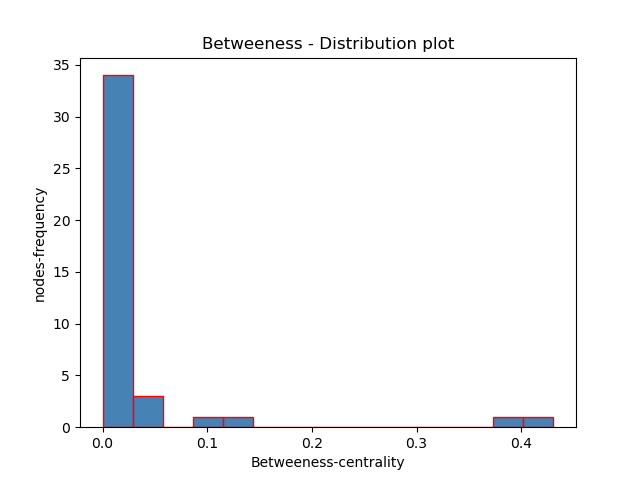

# hobbit-network-analysis

# Project Overview
Network Analysis of Character Interactions in The Hobbit
This project applies network analysis techniques to study character interactions in J.R.R. Tolkien’s The Hobbit.

The network consists of:
- 41 characters (nodes)
- 160 interactions (edges)

We use graph theory metrics such as:
- Degree Centrality
- Betweenness Centrality
- Closeness Centrality
- K-core decomposition
- Clique detection

The goal is to identify key characters and understand the structure of the narrative.

# key Findings
- Bilbo Baggins has the highest degree centrality → most connected character
- Thorin Oakenshield has the highest betweenness → acts as a bridge
- The network has low density (0.195) → sparse interactions
- The network is fully connected → strong narrative cohesion

# visualization

# Technology Used
- Python
- NetworkX
- Matplotlib / Seaborn
- Jupyter Notebook

# Dataset used
Dataset: Character interaction network from The Hobbit
Source: https://github.com/aholanda/charnet

# How to Run
git clone https://github.com/adedolapo-adeniran/hobbit-network-analysis.git
cd hobbit-network-analysis

pip install -r requirements.txt

jupyter notebook

# Report
Full report available here:
https://1drv.ms/b/c/6b0f9aac61358ac1/IQBQrClm8s1WRoHXg-E44ZPsAdjb12pmYhzvfAswXnZ6UqQ?e=wlv0Jh
